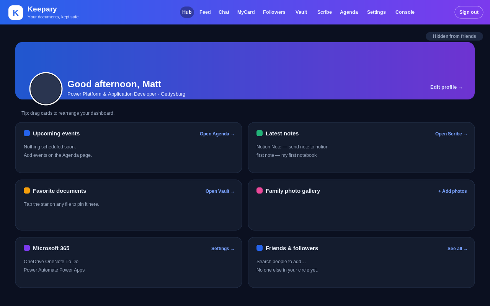
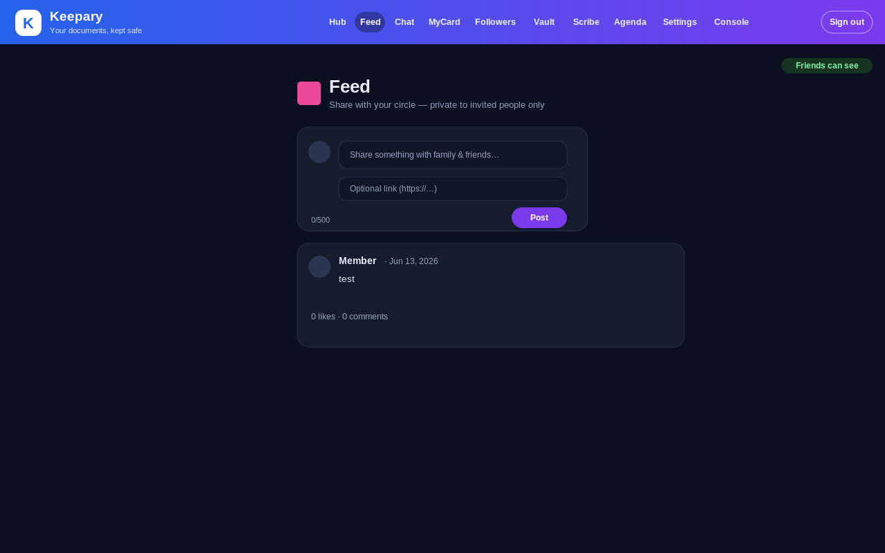
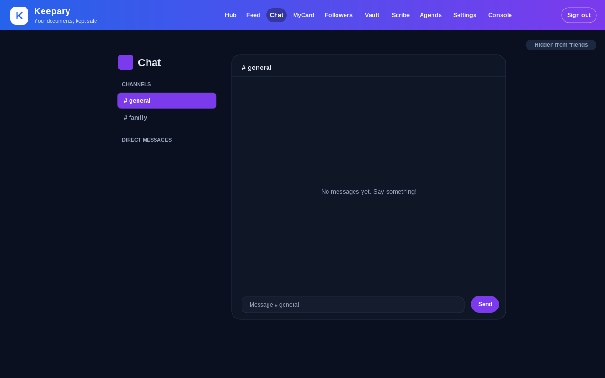
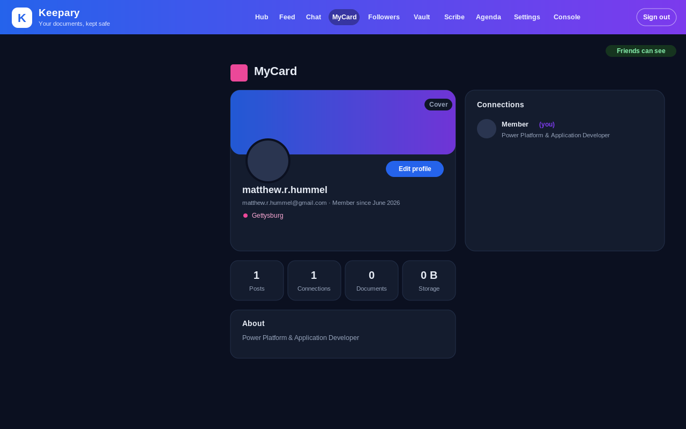
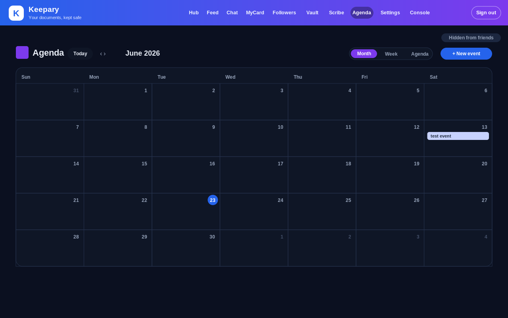
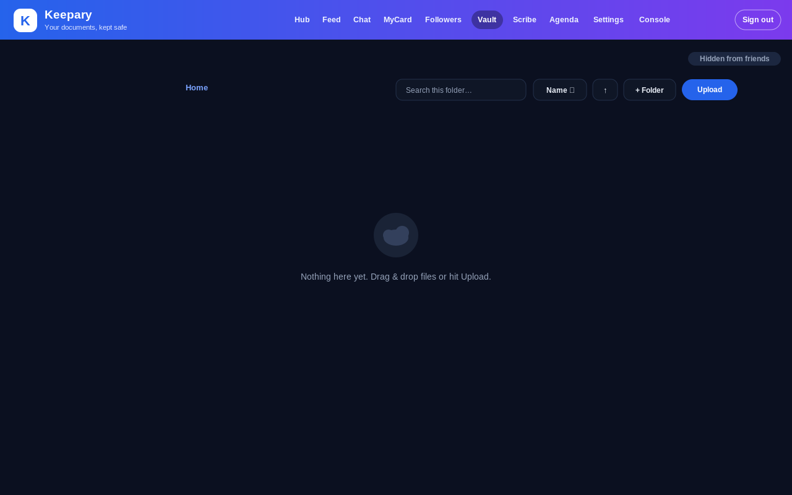

# Screenshots

A look inside Keepary — the core feed + profiles + chat loop, with the vault, notes, and calendar as supporting tools. Representative previews of the running app UI.

## Hub
A drag-to-rearrange dashboard that ties every tool together.

## Feed
Bluesky-style posts, likes, and comments — private to your circle.

## Chat
Slack/Discord-style channels and DMs over Supabase Realtime.

## MyCard (profile)
Rich profiles with stats, about, and connections.

## Agenda (calendar)
A personal calendar with shareable, color-coded calendars.

## Vault
A private document vault backed by a locked-down storage bucket.

